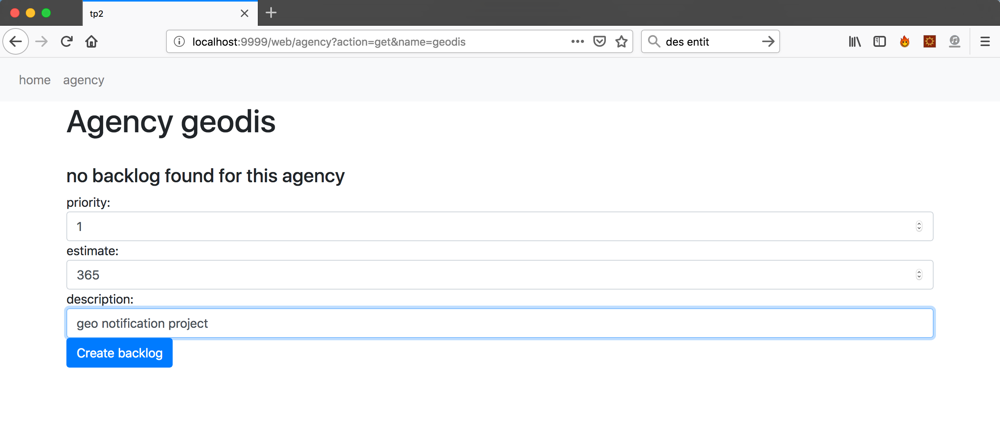

# TP2 Java ee réalisé par Bruno PIZZO et Tristan Marie

Une application qui permet de gerer les backlog des agences.
Pour plus d'info lire le sujet du tp 2.

Dans le cadre de ce tp nous avons utilisé le serveur TomEE plume 7.1.0

## Entity

Les objets persistents sont : Agency, Backlog, Userstory, Comment

Quand une entité est créé l'ID est autogeneré (autoincrement), sauf pour le cas des ``agency`` où on utilise le nom comme Id

Le schéma suivant montre la relation qu'il y a entre les entités :


Les relations entre les entités sont unidirectionnels

```java

//generation des Id
@Id
@GeneratedValue(strategy = GenerationType.SEQUENCE)
private int id;

//relation 1:1
@OneToOne
private MyObject myObject;

//relation 1:N
@OneToMany
private List<MyObject> myObjectList = new ArrayList<>();

```


Pour la persistence nous avons utilisé EclipseLink avec la proprieté : drop-and-create

## Auth

nous avons ajouté une authentification de type basic auth, le systeme de login permet non seulment de securiser l'application web mais aussi de indiquer dans l'attribut `owner` de l'entité `Comment` le nom de l'utilisateur qui a créé le commentaire


voici la configuration des utilisateur dans le fichier PATH_TO_TomEE/conf/tomcat-users.xml :


Si vous si vous souhaitez ne pas avoir de basic auth vous devez supprimer les lignes suivantes dans le fichier web.xml


## Usage

La page d'acceuil se trouve à l'addresse :

127.0.0.1:PORT/web/

Pour créer des agence cliquez sur agency et ajoutez des agence à l'aide du formulaire, en suite pour chache agence vous pouvez créer un backlog, des userstories et des commentaires.

Voici quelques immages qui montrent l'interface de l'application :


Si une agence ne possede pas de backlog alors un formulaire pour la creation du backlog s'affiche,
les chaps priority et estimate sont des entiers



Maintenant vous povez acceder au backlog de l'agence


 
